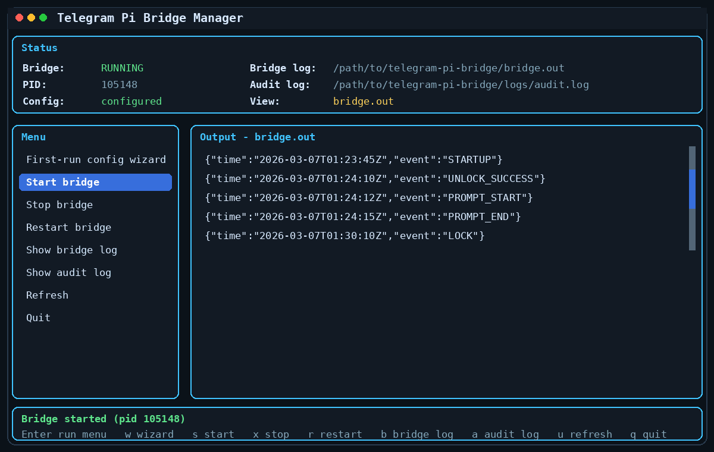

# @lpgn/telepi 📡🥧

A small, opinionated, slightly paranoid bridge between Telegram and your [pi](https://github.com/badlogic/pi-mono) agent.

License: [MIT](./LICENSE)

## What this is

This repo is a **single-owner remote admin bridge** for talking to **pi** through Telegram.

That is the whole trick:

- **pi** is the agent
- **this repo** is the Telegram-shaped door
- a few locks were added so the door isn't completely feral

No giant platform. No orchestration theme park. No "AI operating system for synergy-driven workflows." Just a Telegram bot awkwardly wired into your pi so you can talk to it without SSHing from your phone while waiting in line for coffee.

## What this is not

- not a SaaS
- not a multi-user chat platform
- not an enterprise product
- not guaranteed to be a good idea

## Vibe-coded disclaimer

This project was **vibe coded**.

Which means:

- it works for me
- it may work for you
- it may also become a tiny goblin at an inconvenient time

There is **no warranty** and **no promise of fitness for any purpose**.
Please review the code, restrict the workspace, and do not point this at anything you cannot afford to have deleted by a hallucinating LLM.

## Dependency: pi

This bridge depends on **pi** and uses the **pi SDK**.

- pi repo: https://github.com/badlogic/pi-mono
- npm package: https://www.npmjs.com/package/@mariozechner/pi-coding-agent

You need pi installed, configured, and authenticated separately.
This bridge does **not** replace pi. It just gives pi a Telegram handle.

Examples:

- `pi /login`
- credentials stored in `~/.pi/agent`

If pi is broken locally, this bridge will not magically become wise through suffering. Fix pi first.

## Features (or "why you might want this")

- **Telegram bot connection**: chat with pi on the go
- **Persistent memory**: session history per Telegram chat
- **Aggressively locked by default**: denies everyone unless they know the secret handshake
- **Owner-only**: mapped strictly to your exact numeric Telegram user ID
- **Private-chat-only**: ignores groups to avoid awkward robotic mass-replies
- **TOTP / Shared Secret unlocking**: like a dead-man's switch for your agent
- **Timeout auto-locking**: forgets access after a configurable TTL
- **Audit logging**: for when you inevitably ask "who did that?"
- **Optional owner alerts**: get DMs when unauthorized people try to poke your bot
- **TUI manager**: because typing out `systemctl` commands constantly gets old fast

## TUI (Because CLI arguments are so 2005)

Managing this bridge is surprisingly civil. We have a built-in terminal UI to set up your environment, test the config, and babysit the background daemon.

<p align="center">
  
</p>

## Security model

This version is designed for **one owner only** and **remote admin-style access**.

It is:

- locked by default
- strictly owner-only by Telegram user ID
- private-chat-only by default
- unlockable with **TOTP** (strongly recommended) or a shared secret
- auto-locking after a configurable timeout
- able to snitch on unauthorized attempts directly to your chat
- keeping receipts in an audit log

In other words: simple, but trying very hard not to be reckless.

## Project layout

- `bin/` — executables (`telepi`, `telepi-manage`, `telepi-tui`)
- `src/index.mjs` — main bridge process
- `src/manage.mjs` — CLI manager
- `src/manager-lib.mjs` — shared runtime and config helpers
- `src/tui.mjs` — terminal UI manager
- `.env.example` — configuration template
- `logs/audit.log` — JSON-lines audit log
- `data/sessions/<chat-id>/...` — persistent pi session history

## Installation

### Option A: Install from npm (The civilized way)

```bash
npm install -g @lpgn/telepi
mkdir -p ~/telepi
cd ~/telepi
cp "$(npm root -g)/@lpgn/telepi/.env.example" .env
```

> **Troubleshooting Global Installs:**
> 1. **`EACCES` permissions error:** Do not use `sudo`. Instead, configure `npm` to use a user-owned directory (tools like `nvm` do this automatically):
>    - Run: `mkdir -p ~/.npm-global`
>    - Run: `npm config set prefix '~/.npm-global'`
>    - Re-run the `npm install -g` command above, then follow Step 2 to adjust your `$PATH`.
> 2. **`command not found: telepi` after installing:** If npm successfully installed the package into a custom directory (like `~/.npm-global`), but your terminal can't find the command, your `$PATH` is missing the npm bin folder. 
>    - For **bash/zsh**: Run `echo 'export PATH=~/.npm-global/bin:$PATH' >> ~/.bashrc` and restart your terminal.
>    - For **fish**: Run `fish_add_path $HOME/.npm-global/bin` and restart your terminal.

Then edit `.env`.

By default, the global `telepi` installation uses your current working directory for `.env`, `data/`, `logs/`, `run/`, and generated `systemd/` files.
If you want to keep those files somewhere specific regardless of where you are when you run it, set `TELEPI_HOME=/path/to/telepi-home` in your environment before running it.

### Option B: Run from source (The hacker way)

```bash
git clone https://github.com/lpgn/telepi.git telepi
cd telepi
npm install
cp .env.example .env
```

Then edit `.env`.

Minimum useful config:

```env
TELEGRAM_BOT_TOKEN=your_bot_token
OWNER_TELEGRAM_USER_ID=your_numeric_telegram_user_id
UNLOCK_METHOD=totp
UNLOCK_TOTP_SECRET=your_base32_secret
```

### 4. Make sure pi is installed and authenticated

See:

- https://github.com/badlogic/pi-mono

## Configuration notes

### Recommended: TOTP unlock

```env
UNLOCK_METHOD=totp
UNLOCK_TOTP_SECRET=JBSWY3DPEHPK3PXP
```

Use your own base32 secret and add it to an authenticator app (or just generate one using the built-in TUI's setup menu).
Do **not** use the example secret above in production unless you enjoy improvisational security.

### Alternative: shared secret unlock

```env
UNLOCK_METHOD=secret
UNLOCK_SHARED_SECRET=replace_with_a_long_random_secret
```

### Important config values

- `OWNER_TELEGRAM_USER_ID` — only this numeric Telegram user ID is allowed
- `OWNER_CHAT_ID` — optional extra lock tying it to one specific chat
- `ALLOW_PRIVATE_CHATS_ONLY` — reject groups, supergroups, and channels (default: true)
- `UNLOCK_TTL_MINUTES` — auto-lock timeout
- `PI_WORKSPACE_DIR` — where pi will operate
- `PI_AGENT_DIR` — where pi config/auth lives
- `PI_MODEL_PROVIDER` / `PI_MODEL_NAME` — optional fixed model override
- `PI_THINKING_LEVEL` — optional thinking level override
- `UNLOCK_STATE_FILE` — optional persisted unlock state file
- `AUDIT_LOG_FILE` — audit log location

## Usage

### Start the bridge

```bash
telepi
```

Or run it locally from the repo with:

```bash
npm start
```

### Use the TUI manager

```bash
telepi-tui
```

Or from the repo:

```bash
npm run tui
```

The TUI is organized into three pleasantly functional sections:

- **Setup** — wizard, settings, unlock secret generation (TOTP QR codes!), systemd file generation, and config tests
- **Bridge** — check status, start, stop, restart
- **Logs** — view and clear bridge/audit logs like a true sysadmin

Useful keys:

- `Enter` — open selected section or run selected action
- `Esc` — go back (or escape your mistakes)
- `1` — jump to Setup
- `2` — jump to Bridge
- `3` — jump to Logs
- `r` — refresh
- `PgUp` / `PgDn` — scroll your logs
- `q` — quit

### Use the CLI manager

```bash
telepi-manage status
telepi-manage start
telepi-manage stop
telepi-manage restart
telepi-manage logs bridge
telepi-manage logs audit
```

### Use it from Telegram

Commands you must type to the bot:

- `/status` — show whether the bot is locked or feeling talkative
- `/unlock <code>` — unlock agent access temporarily (using your TOTP code or shared secret)
- `/lock` — lock immediately (for when the paranoia kicks in)
- `/clear` — clear the current pi session history (only when unlocked)

Normal text prompts are forwarded to pi **only while unlocked**.

## How locking works

- The bot starts **locked**. It is naturally suspicious.
- While locked, free-text prompts are politely (or silently) refused.
- `/unlock <code>` unlocks it for `UNLOCK_TTL_MINUTES`.
- After the timeout, it auto-locks again.

So yes, it is basically a remote control for your agent with an anxious man's dead-man switch.

## Alerts and audit log

If `ALERT_OWNER_ON_DENIED=true`, denied attempts generate a Telegram alert to the owner chat. Be prepared to find out how many bots are scraping Telegram usernames.

Audit events are appended as JSON lines to `AUDIT_LOG_FILE`.

Typical events include:

- `DENIED_USER`
- `DENIED_CHAT_TYPE`
- `UNLOCK_SUCCESS`
- `UNLOCK_FAILURE`
- `PROMPT_START`
- `PROMPT_END`
- `PROMPT_ERROR`

## Security notes

Please do not treat "it has a lock" as equivalent to "it is impenetrable."

Recommended precautions:

- Enable Telegram 2FA on your account so someone can't steal your bot via SIM swapping
- Keep the bot token securely wrapped
- Restrict permissions on `.env`, `logs/`, `data/`, and `~/.pi/agent`
- Narrow `PI_WORKSPACE_DIR` as much as possible so pi doesn't accidentally eat your system files
- Set `OWNER_CHAT_ID` if you want to pin access strictly to one chat instance
- Rotate secrets if they ever appear in chat history, shell history, screenshots, or anywhere that feels bad

## systemd example

The TUI can actually generate this for you automatically!
But if you're stubborn and like doing it by hand, the repo includes a generic service template at:

- `systemd/telepi.service.example`

If you use the TUI generator or copy it yourself, your own machine-specific local service file will live at:

- `systemd/telepi.service`

That local file is gitignored on purpose. No leaking paths.

If you want to install it system-wide, copy the generated or template file to:

- `/etc/systemd/system/telepi.service`

Example of what the TUI generates:

```ini
[Unit]
Description=telepi
After=network-online.target
Wants=network-online.target

[Service]
Type=simple
User=youruser
WorkingDirectory=/opt/telepi
EnvironmentFile=/opt/telepi/.env
ExecStart=/usr/bin/env telepi
Restart=always
RestartSec=5
NoNewPrivileges=true
PrivateTmp=true
ProtectControlGroups=true
ProtectKernelTunables=true
ProtectKernelModules=true
LockPersonality=true
RestrictSUIDSGID=true
UMask=0077

[Install]
WantedBy=multi-user.target
```

Then make it official:

```bash
sudo systemctl daemon-reload
sudo systemctl enable --now telepi
sudo systemctl status telepi
```

## Final warning, but with affection

This project is small on purpose. That is a feature.

If you wanted a massive AI enterprise workflow orchestrator platform, this is emphatically not that.
If you wanted a compact Telegram-to-pi bridge with a few sensible security rails and a genuinely delightful manager TUI, that is exactly what this is.

Use it, fork it, improve it, or laugh at it.
But please do so responsibly.

